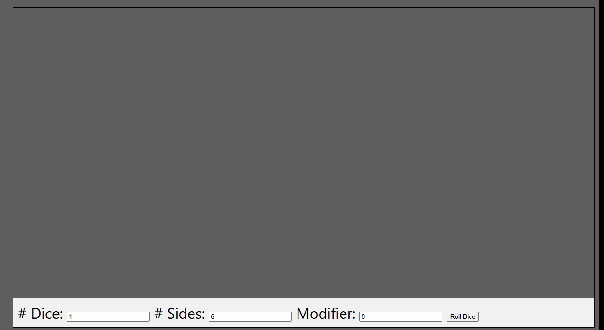

<br>
# RNG <br>
Provides random utilities Actions / Conditions / Expressions for Construct 3, include a Seperate Random Number Generator based on Mersenne Twister <br>
<br>
Author: piranha305 <br>
Website: https://piranha305.itch.io/ <br>
Addon Url: https://www.construct.net/en/make-games/addons/1075/rng <br>
Download Latest Version : [Version: 1.0.0.3](https://github.com/armandoalonso/rng/releases/latest) <br>
<sub>Made using [c3ide2-framework](https://github.com/ConstructFund/c3ide2-framework) </sub><br>

## Table of Contents
- [Usage](#usage)
- [Examples Files](#examples-files)
- [Properties](#properties)
- [Actions](#actions)
- [Conditions](#conditions)
- [Expressions](#expressions)
---
## Usage
To build the addon, run the following commands:

```
npm i
node ./build.js
```

To run the dev server, run

```
npm i
node ./dev.js
```

The build uses the pluginConfig file to generate everything else.
The main files you may want to look at would be instance.js and scriptInterface.js

## Examples Files
- [piranha305_rng_exmaple](./examples/piranha305_rng_exmaple.c3p)
</br>
</br>

</br>

</br>

---
## Properties
| Property Name | Description | Type |
| --- | --- | --- |
| Replace System Seed | Replace the seed with a new one | check |
| Seed | The seed to use for the RNG | text |


---
## Actions
| Action | Description | Params
| --- | --- | --- |
| Set Seed | Sets the seed to use for the RNG | Seed             *(string)* <br> |
| Roll Dice | Rolls a number of dice with a number of sides and adds a modifier | Number of Dice             *(number)* <br>Number of Sides             *(number)* <br>Modifier             *(number)* <br>Tag             *(string)* <br> |
| Load JSON Data | Loads JSON data, That can be used for random selection | Tag             *(string)* <br>JSON             *(string)* <br> |
| Pick Random Position In Layout | Picks a random position in the layout, can access using RandomX and RandomY expressions |  |
| Pick Random Position In Layout With Margin | Picks a random position in the layout with a margin, can access using RandomX and RandomY expressions | Margin             *(number)* <br> |
| Pick Random Position In Viewport | Picks a random position in the viewport, can access using RandomX and RandomY expressions |  |
| Pick Random Position In Viewport With Margin | Picks a random position in the viewport with a margin, can access using RandomX and RandomY expressions | Margin             *(number)* <br> |
| Get Random Position In Rect | Gets a random position in a rect | Left             *(number)* <br>Top             *(number)* <br>Right             *(number)* <br>Bottom             *(number)* <br> |
| Pick Random Position In Sprite | Picks a random position in a sprite, can access using RandomX and RandomY expressions | Sprite             *(object)* <br> |
| Pick Random Position In Circle | Picks a random position in a circle, can access using RandomX and RandomY expressions | X             *(number)* <br>Y             *(number)* <br>Radius             *(number)* <br> |


---
## Conditions
| Condition | Description | Params
| --- | --- | --- |
| Chance | Returns true with a given chance | Chance *(number)* <br> |


---
## Expressions
| Expression | Description | Return Type | Params
| --- | --- | --- | --- |
| Roll | Rolls a number of dice with a number of sides and adds a modifier | number | Number of Dice *(number)* <br>Number of Sides *(number)* <br>Modifier *(number)* <br> | 
| GetDiceFromLastRoll | Gets a die from the last roll | number | Index *(number)* <br> | 
| GetDiceRollSum | Gets the sum of a roll | number | Tag *(string)* <br> | 
| GetDiceRollValue | Gets the value of a roll | number | Tag *(string)* <br>Index *(number)* <br> | 
| GetRandomToken | Gets a random token from a string | string | Text *(string)* <br>Seperator *(string)* <br> | 
| GetRandomFromCSV | Gets a random value from a comma seperated string | string | comma seperated string *(string)* <br> | 
| GetRandomFromCSVWeighted | Gets a random value from a comma seperated string with weights | string | comma seperated string *(string)* <br>Weights *(string)* <br> | 
| RandomString | Generates a random string | string | Length *(number)* <br> | 
| RandomNumber | Generates a random number | string | Length *(number)* <br> | 
| RandomStringFromPool | Generates a random string from a pool of characters | string | Length *(number)* <br>Pool *(string)* <br> | 
| RandomFromJsonArray | Gets a random value from a JSON array | string | Tag *(string)* <br>Path *(string)* <br> | 
| Guid | Generates a Guid | string |  | 
| RandomX | Gets the last random X position | number |  | 
| RandomY | Gets the last random Y position | number |  | 
