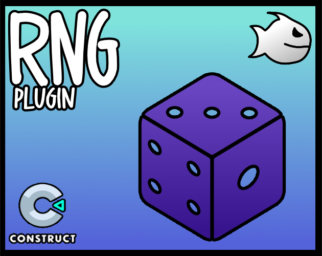

<br>
# RNG
<i>Provides random utilities Actions / Conditions / Expressions for Construct 3, include a Seperate Random Number Generator based on Mersenne Twister</i> <br>
### Version 2.0.0.1

[](https://github.com/armandoalonso/rng/releases/download/piranha305_rng-2.0.0.1.c3addon/piranha305_rng-2.0.0.1.c3addon)
<br>
<sub> [See all releases](https://github.com/armandoalonso/rng/releases) </sub> <br>

---
<b><u>Author:</u></b> piranha305 <br>
<sub>Made using [CAW](https://marketplace.visualstudio.com/items?itemName=skymen.caw) </sub><br>

## Table of Contents
- [Usage](#usage)
- [Examples Files](#examples-files)
- [Properties](#properties)
- [Actions](#actions)
- [Conditions](#conditions)
- [Expressions](#expressions)
---
## Usage
To build the addon, run the following commands:

```
npm i
npm run build
```

To run the dev server, run

```
npm i
npm run dev
```

## Examples Files
| Images | Description | Download |
| --- | --- | --- |
|  | rng_examples | [](https://github.com/armandoalonso/rng/raw/refs/heads/main/examples/rng_examples.c3p) |

---
## Properties
| Property Name | Description | Type |
| --- | --- | --- |
| Seed | Seed for the random number generator | text |


---
## Actions
| Action | Description | Params
| --- | --- | --- |
| Clear Dice Roll History | Clears the dice roll history |  |
| Roll Dice | Rolls a number of dice with a number of sides and adds a modifier | Number of Dice             *(number)* <br>Number of Sides             *(number)* <br>Modifier             *(number)* <br>Tag             *(string)* <br> |
| RandomSeed | Generates a random seed |  |
| SetSeed | Sets the seed to use for the RNG | Seed             *(string)* <br> |
| Pick Random Point In Circle | Picks a random point in a circle, can access using RandomX and RandomY expressions | Center X             *(number)* <br>Center Y             *(number)* <br>Radius             *(number)* <br>Edge             *(boolean)* <br> |
| Pick Random Position In Layout | Picks a random position in the layout, can access using RandomX and RandomY expressions |  |
| Pick Random Position In Layout With Margin | Picks a random position in the layout with a margin, can access using RandomX and RandomY expressions | Left             *(number)* <br>Right             *(number)* <br>Top             *(number)* <br>Bottom             *(number)* <br> |
| Pick Random Position In Rect | Picks a random position in a rectangle, can access using RandomX and RandomY expressions | Left             *(number)* <br>Top             *(number)* <br>Right             *(number)* <br>Bottom             *(number)* <br> |
| Pick Random Position In Sprite | Picks a random position in a sprite, can access using RandomX and RandomY expressions | Sprite             *(object)* <br>Edge             *(boolean)* <br> |
| Pick Random Position In Viewport | Picks a random position in the viewport, can access using RandomX and RandomY expressions |  |
| Pick Random Position In Viewport With Margin | Picks a random position in the viewport with a margin, can access using RandomX and RandomY expressions | Left             *(number)* <br>Right             *(number)* <br>Top             *(number)* <br>Bottom             *(number)* <br> |


---
## Conditions
| Condition | Description | Params
| --- | --- | --- |
| For Each Rolled Dice | Triggered for each dice rolled |  |
| On Dice Roll | Triggered when a dice is rolled |  |
| Chance | if a random chance is true | Likelihood *(number)* <br> |


---
## Expressions
| Expression | Description | Return Type | Params
| --- | --- | --- | --- |
| DiceRollDiceId | Get the dice id of a dice roll | string | Tag *(string)* <br> | 
| DiceRollModifier | Get the modifier of a dice roll | number | Tag *(string)* <br> | 
| DiceRollSum | Get the sum of a dice roll | number | Tag *(string)* <br> | 
| DiceRollValue | Get the value of a dice roll | number | Tag *(string)* <br>Index *(number)* <br> | 
| LastDiceRollDiceId | Get the dice id of the last dice roll | string |  | 
| LastDiceRollDiceValue | Get the value of a dice in the last dice roll | number | Index *(number)* <br> | 
| LastDiceRollModifier | Get the modifier of the last dice roll | number |  | 
| LastDiceRollSum | Get the sum of the last dice roll | number |  | 
| LoopDiceValue | Get the value of the dice in the loop | number |  | 
| PerlinNoise2D | Get a 2D Perlin noise value | number | X *(number)* <br>Y *(number)* <br>Resolution *(number)* <br> | 
| RandomChoice | Get a random choice from a list | any | List *(string)* <br> | 
| RandomChoiceWeighted | Get a random weighted choice from a list | any | List *(string)* <br>Weights *(string)* <br> | 
| RandomFloat | Get a random float | number | Min *(number)* <br>Max *(number)* <br> | 
| RandomInt | Get a random integer | number | Min *(number)* <br>Max *(number)* <br> | 
| RandomNormal | Get a random number from a normal distribution | number | Mean *(number)* <br>Standard Deviation *(number)* <br> | 
| RandomNumber | Get a random number | string | Length *(number)* <br> | 
| RandomSign | Get a random sign (-1 or 1) | number |  | 
| RandomString | Get a random string | string | Length *(number)* <br> | 
| RandomToken | Get a random token | string | List *(string)* <br> | 
| RandomUUID | Get a random UUID | string |  | 
| Shuffle | Shuffle a comma seperated list | string | List *(string)* <br> | 
| SimplexNoise2D | Get a 2D Simplex noise value | number | X *(number)* <br>Y *(number)* <br>Resolution *(number)* <br> | 
| Seed | Get the seed used for the RNG | number |  | 
| LastX | Gets the last random X position | number |  | 
| LastY | Gets the last random Y position | number |  | 
